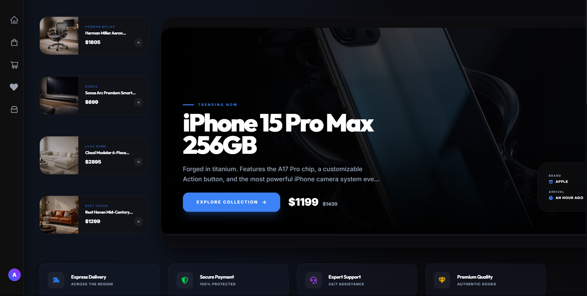
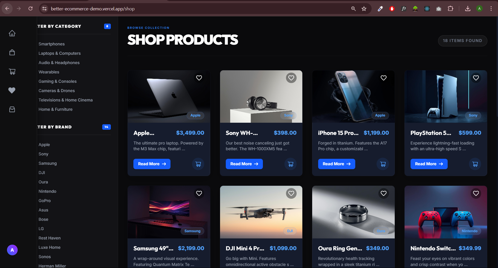
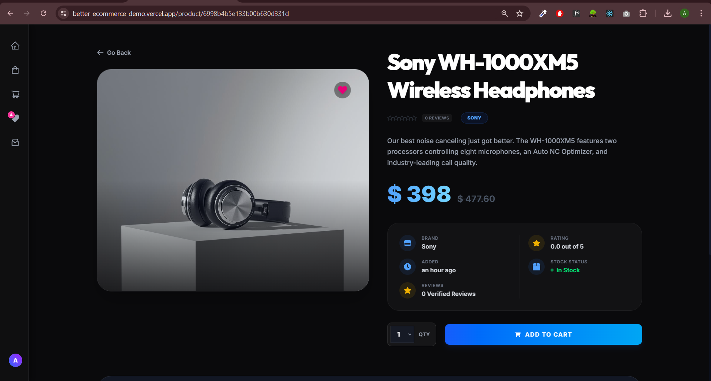
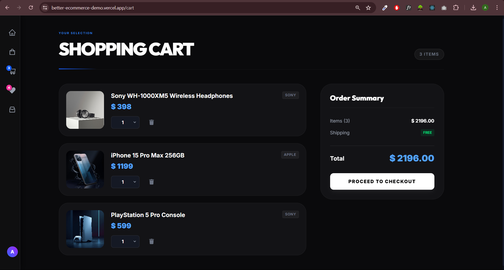
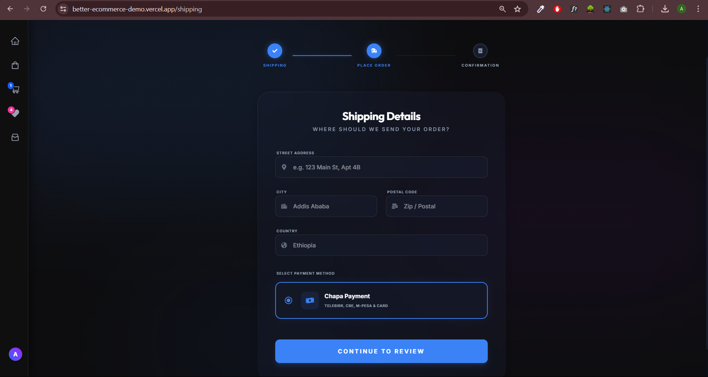
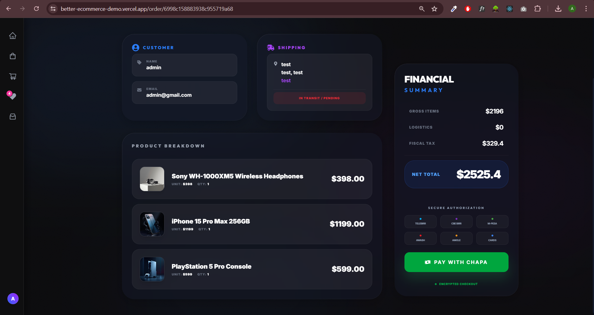
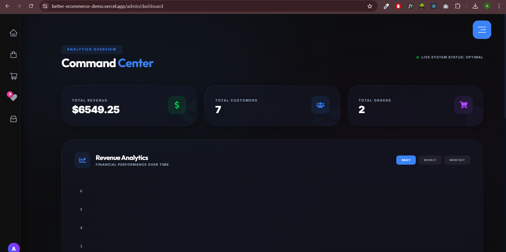
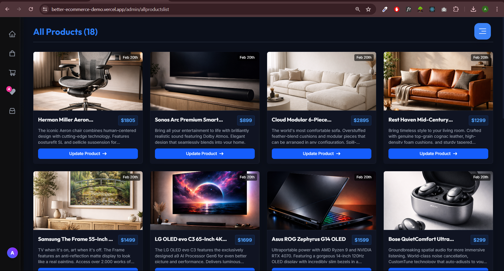
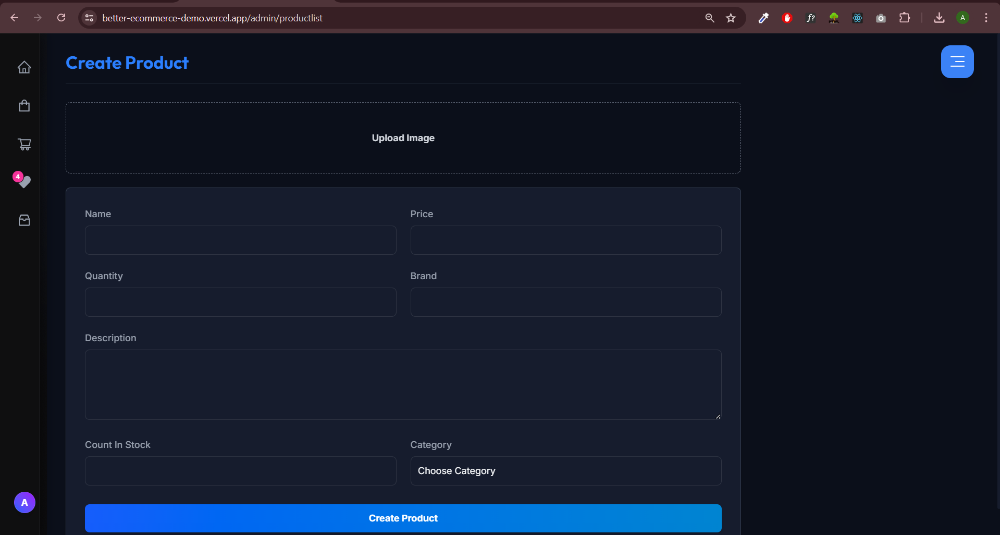
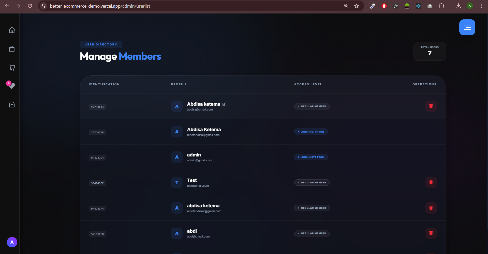

<div align="center">
  
  <h1>🐼 Ethio Panda E-commerce Playground</h1>
  
  <p>A full-stack, state-of-the-art e-commerce platform crafted with a seamless user interface and a robust backend. Integrated with advanced dashboards, role-based access control, and dynamic product management.</p>

  <p>
    <a href="https://better-ecommerce-demo.vercel.app"><b>🌐 View Live Demo</b></a> 
  </p>
  
  <p>
    <strong>🔑 Admin Access Credentials:</strong><br/>
    <b>Email:</b> <code>admin@gmail.com</code> &nbsp;|&nbsp; <b>Password:</b> <code>12345678</code>
  </p>

  <p>
    
    
    
    
    
    
  </p>
</div>

---

## 🚀 Key Features

### 🛍️ User Experience

- **Responsive Design:** Completely adaptive UI for mobile, tablet, and desktop viewing.
- **Product Browsing & Filtering:** Dynamic shop view to search, filter, and discover products.
- **Seamless Cart Management:** Add/remove items with localized state via Redux Toolkit.
- **Order Tracking:** Track orders efficiently right to the user's doorstep.
- **Payment Integration:** Secure checkout flow ready for integration.

### 🛡️ Admin Dashboard

- **Comprehensive Analytics:** Detailed statistical overview and reporting with ApexCharts.
- **Product Management:** Efficiently create, update, or remove products (including image uploads).
- **User Delegation:** Complete user management interface to assign/revoke admin capabilities.
- **Order Handling:** Real-time visibility into incoming orders and shipping statuses.

---

## 📸 Snapshot Gallery

<table align="center">
  <tr>
    <td align="center"><b>Homepage</b><br/></td>
    <td align="center"><b>Discover & Shop</b><br/></td>
  </tr>
  <tr>
    <td align="center"><b>Product Details</b><br/></td>
    <td align="center"><b>Shopping Cart</b><br/></td>
  </tr>
  <tr>
    <td align="center"><b>Checkout & Shipping</b><br/></td>
    <td align="center"><b>Order Tracking</b><br/></td>
  </tr>
  <tr>
    <td colspan="2" align="center"><h3>⚙️ Admin Utilities</h3></td>
  </tr>
  <tr>
    <td align="center"><b>Dashboard & Analytics (ApexCharts)</b><br/></td>
    <td align="center"><b>Product Inventory</b><br/></td>
  </tr>
  <tr>
    <td align="center"><b>Create New Product</b><br/></td>
    <td align="center"><b>User Management & Roles</b><br/></td>
  </tr>
</table>

---

## 💻 Tech Stack

| Category             | Technologies                                             |
| -------------------- | -------------------------------------------------------- |
| **Frontend Layout**  | React.js 19, TypeScript, Vite, Tailwind CSS v4, Flowbite |
| **State Management** | Redux Toolkit, RTK Query                                 |
| **Routing**          | React Router v7                                          |
| **Charts & Visuals** | ApexCharts, React Slick                                  |
| **Backend API**      | Node.js, Express.js                                      |
| **Database & ODM**   | MongoDB, Mongoose v9                                     |
| **Authentication**   | JSON Web Token (JWT), bcryptjs                           |

---

## 🛠️ Getting Started Locally

Follow these steps to set up the project locally on your machine.

### Prerequisites

Ensure you have [Node.js](https://nodejs.org/) (v18+) and [MongoDB](https://www.mongodb.com/) installed and running.

### 1. Clone & Install Dependencies

```bash
# Clone the repository
git clone https://github.com/your-username/ethio-panda-ecommerce.git
cd ethio-panda-ecommerce

# Install frontend dependencies
cd frontend
npm install

# Install backend dependencies
cd ../backend
npm install
```

### 2. Environment Variables Configuration

Create `.env` files for both frontend and backend configurations referencing the expected configuration values.

**Backend `backend/.env`:**

```env
PORT=5000
MONGO_URI=your_mongodb_connection_string
JWT_SECRET=your_jwt_super_secret
```

### 3. Database Seeding (Optional)

You can seed your local database utilizing the mock configurations injected with user roles:

```bash
cd backend
npm run seed
```

### 4. Running the Development Servers

Open two terminals to run the backend and frontend simultaneously:

**Terminal 1 (Backend):**

```bash
cd backend
npm run dev
```

**Terminal 2 (Frontend):**

```bash
cd frontend
npm run dev
```

Visit the app securely at `http://localhost:5173`.

---

## 🤝 Contribution Guidelines

Contributions, issues, and feature requests are welcome!

1. Fork the project.
2. Create your Feature Branch (`git checkout -b feature/AmazingFeature`).
3. Commit your changes (`git commit -m 'Add some AmazingFeature'`).
4. Push to the Branch (`git push origin feature/AmazingFeature`).
5. Open a Pull Request.

<br />
<p align="center">Designed and crafted meticulously. Built with ❤️ for the development community.</p>
